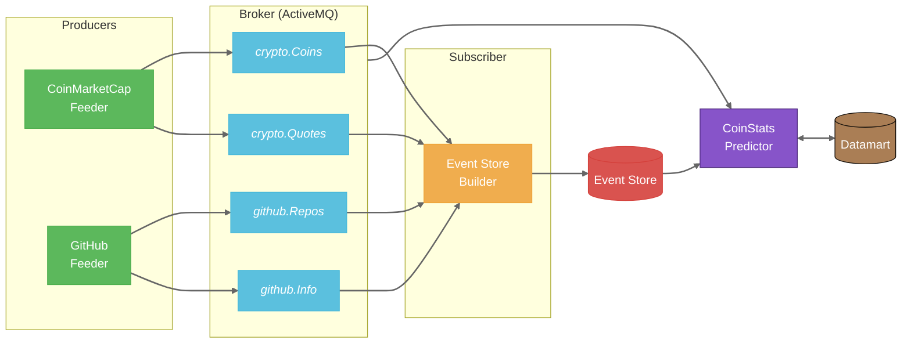

<div align="center">

# 🪙 CryptoArthead

### *Plataforma Avanzada de Análisis de AltCoins*

[](https://openjdk.org/)
[](https://maven.apache.org/)
[](https://activemq.apache.org/)
[](https://sqlite.org/)
[](https://python.org/)

*Empoderando a inversores de criptomonedas con insights impulsados por IA a través del análisis integral de repositorios GitHub e integración de datos de mercado en tiempo real.*

</div>

## 📋 Tabla de Contenidos

- [📜 Descripción](#-descripción)
- [✨ Características](#-características)
- [🔌 APIs Utilizadas](#-apis-utilizadas)
- [🏗️ Arquitectura](#️-arquitectura)
- [💾 Estructura del Datamart](#-estructura-del-datamart)
- [📐 Diagramas de Clases](#-diagramas-de-clases)
- [🔧 Requisitos](#-requisitos)
- [🚀 Instalación y Uso](#-instalación-y-uso)
- [🧪 Validación y Tests](#-validación-y-tests)
- [👥 Autores](#-autores)
- [📄 Licencia](#-licencia)


## 📜 Descripción

CryptoArthead es un analizador de AltCoins que estudia distintos parámetros de las criptomonedas basándose en su repositorio de GitHub. El objetivo es proporcionar a los inversores información detallada y relevante que les permita tomar decisiones más informadas antes de invertir.

Además de los datos de GitHub, el sistema utiliza información proveniente de CoinMarketCap, permitiendo obtener datos de calidad de cada moneda. El resultado es un datamart consolidado y actualizado que permite ejecutar modelos predictivos sobre el comportamiento de las criptomonedas emergentes.

## ✨ Características

CryptoArthead ofrece un conjunto completo de características diseñadas para proporcionar análisis profundos y precisos de criptomonedas:

- **🔍 Recolección de Datos en Tiempo Real**: Extracción automatizada de datos desde las APIs de GitHub y CoinMarketCap
- **🧠 Análisis en Tiempo Real** de repositorios GitHub de criptomonedas emergentes
- **📊 Integración de Datos de Mercado** directamente desde CoinMarketCap
- **🏗️ Arquitectura Lambda** para manejar tanto procesamiento en tiempo real como por lotes
- **📈 Análisis Predictivo**: Modelos de machine learning para predicción de tendencias de criptomonedas
- **🔄 Procesamiento Basado en Eventos** mediante cola de mensajes ActiveMQ
- **🖥️ Interfaz CLI Interactiva**: Interfaz de línea de comandos amigable para exploración de datos
- **⏱️ Actualizaciones Periódicas** cada 5 minutos para mantener datos recientes
- **📋 Pruebas Exhaustivas**: Amplia cobertura de pruebas con JUnit


## 🔌 APIs Utilizadas

Hemos escogido la API de GitHub y la de CoinMarketCap por el gran auge de las criptomonedas en los últimos años, siendo un tema de interés para muchos potenciales usuarios.

- **📊 GitHub API**: Nos permite analizar la actividad de desarrollo, la calidad del código y la comunidad de cada proyecto.
- **💹 CoinMarketCap API**: Proporciona datos de mercado como precio, capitalización y volumen de trading.

La combinación de ambas fuentes permite correlacionar la actividad de desarrollo con el comportamiento del mercado.

## 🏗️ Arquitectura

El proyecto implementa una **Arquitectura Lambda**, donde cada módulo utiliza una **Arquitectura Hexagonal** (clean architecture). Esta combinación permite mantener bien separada la lógica de negocio de los componentes de infraestructura, facilitando mantenimiento y extensión. El siguiente diagrama muestra el flujo de datos a través del sistema:



### 🧩 Principios de diseño aplicados

- **🧱 Single Responsibility Principle**: Manteniendo el código modularizado, asignando a cada clase una única responsabilidad.
- **🚪 Open/Close Principle**: Facilitando la extensión del sistema sin modificar el código existente.

Ejemplo de implementación de estos principios:

```java
GithubRepositoryStore store = new ActiveMQStore(args[1]);
Controller controller = new Controller(provider, store, repositories);
controller.execute();
```

```java
CoinStore store = new ActiveMQStore(args[1]);
Controller controller = new Controller(provider, store);
printSystemInformation(queries);
controller.execute();
```

### 🧩 Módulos del sistema

El proyecto consta de 4 módulos:

1. **🌐 GitHubFeeder**: Alimenta un CSV usando los eventos captados de Github, haciendo llamadas cada 5 minutos.
2. **💰 CoinMarketCapFeeder**: Similar al anterior, pero para CoinMarketCap.
3. **🗃️ EventStoreBuilder**: Recibe los mensajes de ActiveMQ y los guarda como eventos.
4. **🧠 CoinStatsPredictor**: Aplica modelos de aprendizaje para procesar el datamart y obtener predicciones.


## 💾 Estructura del Datamart

El datamart se estructura a partir de tres archivos CSV:

1. **📊 CSV de GitHub**: Datos en bruto procedentes de los eventos de GitHub.
2. **💹 CSV de CoinMarketCap**: Datos en bruto de los eventos de CoinMarketCap.
3. **🔄 Datamart consolidado**: Unifica la información según el nombre y la fecha de los eventos.

El datamart definitivo contiene todos los eventos históricos procesados hasta el momento, representando una versión integrada y depurada de las fuentes originales, ideal para el análisis y la aplicación de modelos predictivos.

## 📐 Diagramas de Clases

### 🔄 Diagrama de clases de los feeders

Los siguientes feeders implementan la lógica de extracción de datos desde las APIs externas y la envían al sistema a través de ActiveMQ o directamente a base de datos. Ambos siguen una estructura modular con responsabilidad única:

- **🌐 GitHubFeeder**: [Ver diagrama](https://github.com/user-attachments/assets/7168fef4-81ae-437e-801e-71f743f0eeb6)

- **💰 CoinMarketCapFeeder**: [Ver diagrama](https://github.com/user-attachments/assets/e560bc3e-e88b-4907-96ed-79fe409dc3fd)

### 🗃️ Diagrama de clases del EventStoreBuilder

El módulo EventStoreBuilder consume eventos desde ActiveMQ y los guarda como archivos .events estructurados por tipo y fecha. Sigue una arquitectura por capas y está diseñado para desacoplar el origen de los datos de su almacenamiento:

- **🗃️ EventStoreBuilder**: [Ver diagrama](https://github.com/user-attachments/assets/893c8ea9-0b61-4e95-87dc-e277aa4f557c)

### 🧠 Diagrama de clases del CoinStatsPredictor

El módulo CoinStatsPredictor aplica distintos modelos de aprendizaje automático sobre el datamart generado, permitiendo al usuario lanzar predicciones personalizadas a través de una interfaz CLI:

- **🧠 CoinStatsPredictor**: [Ver diagrama](https://github.com/user-attachments/assets/709219d5-f39a-40f3-96e5-c56e319e4262)


## 🔧 Requisitos

- 📨 Broker de mensajería ActiveMQ instalado e iniciado
- ☕ JDK versión 21
- 🐍 Python 3.11.9 o superior (configurado en las variables de entorno)
- 📦 Librerías de Python necesarias instaladas (se explicará posteriormente)
- 🔌 Conexión a Internet para acceso a las APIs


## 🚀 Instalación

1. **📥 Clona el repositorio:**
   ```bash
   git clone https://github.com/ArtHead-Devs/CryptoArthead.git
   cd CryptoArthead
   ```

2. **🐍 Crea un entorno virtual para Python y actívalo (recomendado):**

   **En Windows:**
   ```bash
   python -m venv crypto_venv
   crypto_venv\Scripts\activate
   ```

   **En macOS/Linux:**
   ```bash
   python -m venv crypto_venv
   source crypto_venv/bin/activate
   ```

   > La creación de un entorno virtual permite aislar las dependencias del proyecto, evitando conflictos con otras aplicaciones Python instaladas en el sistema.

3. **📦 Instala las dependencias para los modelos predictivos:**
   ```bash
   pip install numpy pandas scikit-learn
   ```

   > Este paso es necesario para ejecutar los modelos de aprendizaje automático incluidos en el módulo CoinStatsPredictor.


## 📦 Instalación y Uso

El proyecto funciona siguiendo un orden de ejecución definido, utilizando el broker de mensajería ActiveMQ. Primero se lanzan los dos feeders, luego el EventStore procesa los mensajes, y finalmente el CoinStatsPredictor permite analizar los datos.

### 🔄 Flujo de ejecución

1. **🚀 Iniciar ActiveMQ**
2. **📊 Ejecutar los feeders** (CoinMarketCapFeeder y GitHubFeeder)
3. **🗃️ Ejecutar EventStoreBuilder** para procesar los mensajes
4. **🧠 Ejecutar CoinStatsPredictor** para analizar datos y obtener predicciones

> **Nota:** Todo el desarrollo se realiza utilizando IntelliJ IDEA, no mediante archivos JAR.

### 🖥️ Interfaz CLI del CoinStatsPredictor

La interfaz de línea de comandos ofrece tres opciones:


1. **❓ Solicitar ayuda (1)**: Muestra la lista de monedas, targets y modelos disponibles.
2. **🔍 Iniciar búsqueda (2)**: Permite seleccionar monedas, targets y modelos para el análisis.
3. **🚪 Salir (0)**: Finaliza el programa.

#### 📋 Opciones disponibles

```
--- Help: possible values ---

Available Coins:
 - Internet Computer
 - Chainlink
 - XRP
 - Ethereum
 - Polkadot
 - TRON
 - Stellar
 - Cardano
 - Avalanche
 - Bittensor

Available Targets:
 - price
 - volumeChange24h
 - percentChange1h
 - percentChange24h
 - percentChange7d
 - percentChange30d
 - percentChange60d
 - percentChange90d

Available Models:
 - LinearRegression
 - KNN
 - SVM
 - DecisionTree
 - RandomForest
```

### 🔍 Ejemplo de búsqueda

Para realizar una búsqueda, se seleccionan las monedas, los targets y los modelos que se desean utilizar (separados por comas):


## 🧪 Validación y Tests

Para garantizar el correcto funcionamiento del sistema, se han implementado múltiples pruebas utilizando JUnit:

<details><summary>📊 Tests de CoinMarketCap</summary>

- **CoinMarketCapConnectionTest**: Verifica la conexión con la API.
- **CoinMarketCapDeserializerTest**: Comprueba la correcta interpretación de los datos JSON.
- **CoinMarketCapFetcherTest**: Testea la recolección de datos de forma periódica.
- **CoinMarketCapProviderTest**: Valida el flujo completo de obtención y entrega de datos.
- **CoinRepositoryTest**: Comprueba la inserción y consulta de monedas en SQLite.
- **QuoteRepositoryTest**: Testea la persistencia de precios y estadísticas.
- **SQLiteConnectionTest**: Valida la conexión con la base de datos.
- **TableCreatorTest**: Comprueba que las tablas necesarias se crean correctamente.

CoinMarketCap proporciona una API key de prueba, lo que facilita la ejecución de tests reales sin exponer información sensible.

</details>

<details><summary>🌐 Tests de GitHub</summary>

- **GithubConnectionTest**: Valida la conexión con la API de GitHub.
- **GithubDeserializerTest**: Asegura la correcta transformación de los datos JSON.
- **GithubFetcherTest**: Verifica la correcta extracción de datos.
- **GithubProviderTest**: Testea la lógica de integración del proveedor.
- **GithubRepositoryTest**: Gestiona la persistencia de los repositorios.
- **InformationRepositoryTest**: Asegura el correcto almacenamiento de información adicional.
- **SQLiteConnectionTest**: Prueba la conexión a SQLite.
- **TableCreatorTest**: Comprueba la creación de estructuras de base de datos.

GitHub no proporciona una API key de testeo, por lo que se utilizó .gitignore para proteger las credenciales locales durante las pruebas.

</details>

## 👥 Autores

Este proyecto fue creado por [ArtHead](https://github.com/ArtHead-Devs), contando con dos integrantes:

- **👨‍💻 Fabio Nesta Arteaga Cabrera**: [NestX10](https://github.com/NestX10)
- **👨‍💻 Pablo Cabeza Lantigua**: [pabcablan](https://github.com/pabcablan)

## 📄 Licencia

Este proyecto está licenciado bajo la licencia MIT. Consulta el archivo `LICENSE` para obtener más detalles.